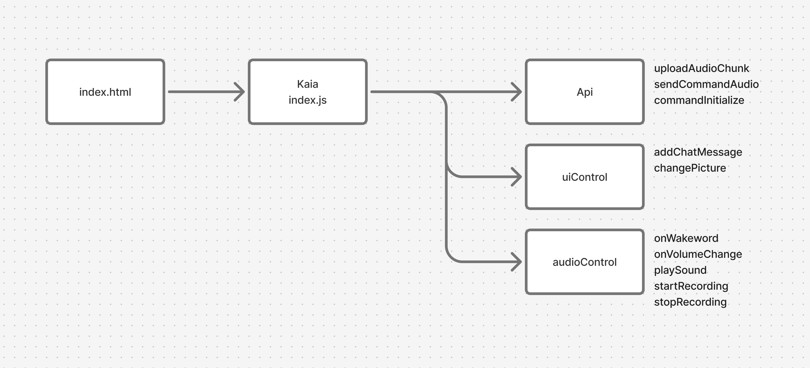

# Kaia frontend

This is a simple web based frontend for [Kaia](https://github.com/okulovsky/kaia) – kitchen ai assistant


## Running the app Locally

1. You should have `NodeJS` 20+ installed. I recommend you using `nvm` to manage NodeJS versions

2. Install js dependencies:
```
npm install
```

3. You should have Kaia running

4. Start js frontend:
```
npm run dev
```

5. Go to `localhost:5137`. Then grant rights for microphone and say the wakeword. Talk for a few seconds and then stay silent. Recording will be uploaded to Kaia

## Caveats when running on other devices (not localhost):

1. Kaia frontend needs to be ran under https – this requirement stems from using Audio Worklets to record raw WAV

2. You currently need to allow your browser to display `mixed content` or run Kaia under HTTPS

Here is how to do it for Firefox – https://support.mozilla.org/en-US/questions/1198894


# Development

This project intentionally doesnt use React or any other frontend libraries



## Linting

The project uses ESLint. To run the linter:
```
npm run lint
```

## Wakeword detection:

This package uses vosk offline speech recognition. 

- documentation: [text](https://github.com/solyarisoftware/voskJs)
- download more models: [text](https://alphacephei.com/vosk/models)
