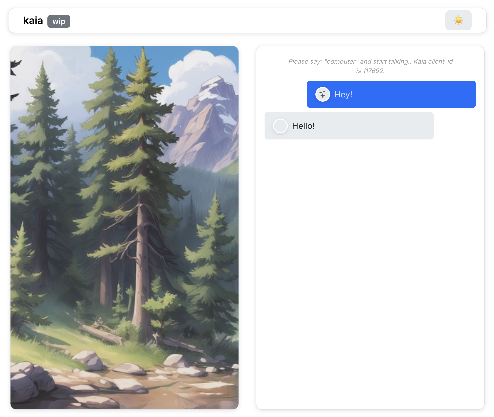

# Kaia frontend

This is a frontend for Kaia – kitchen ai assistant by @okulovsky



## Installation

1. Install Python dependencies:
```bash
# I recommend you to create a virtual environment. Check your system vendor for details 
pip install -r requirements.txt
```

2. Install js dependencies:
```
cd v2
npm install
```

## Running the app

1. Start the backend:
```bash
python server.py
```

2. Start js frontend:
```
npm run dev
```

3. Grant rights for microphone and say the wakeword. Talk for a few seconds and then be silent. Recording will be uploaded to backend 

Recorded WAV files will be saved in the `./recordings/wav` directory in the server. Each recording is named with timestamp and client ID:
```
recordings/recording_YYYYMMDD_HHMMSS_clientid.wav
```

## Browser Support

I tested it on Firefox, but should work on Chrome too


## Wakeword detection:

This package uses vosk offline speech recognition. 

- documentation: [text](https://github.com/solyarisoftware/voskJs)
- download more models: [text](https://alphacephei.com/vosk/models)


# Seems like frontend uses webm, and not wav :-( APIs for working with Wave files are more complex 

# I can easily record .webm files ( client records webm -> client sends chunk every second -> chunk is converted using ffmpeg ) 

+ Code will be more simple (!)
+ Probably less problems with compatibility

- Need to have ffmpeg
- Or need to code the conversion step (+latency)

# Record .wav

- no need to have any new dependencies
- more complex code
- may be more problems with compatibility
- https / single origin / cannot have frontend served just as file :-(


